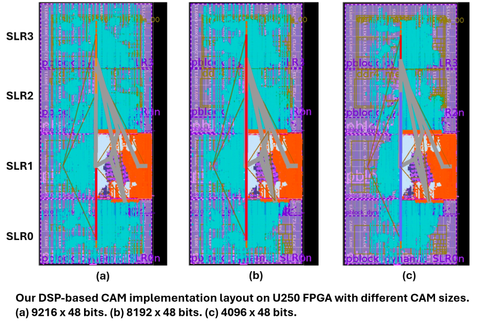

# Configurable DSP-Based CAM Architecture Project

## Overview

This project implements a **Configurable DSP-Based CAM Architecture** for FPGA platforms. The architecture is designed for **scalability**, **efficiency**, and **multi-query support**, targeting applications like **graph analytics** and **databases**.

---

## Features
- **Hierarchical Design**:
  - **CAM Cell**: Utilizes FPGA DSP slices for efficient storage and comparison operations.
  - **CAM Block**: Supports search and update operations.
  - **CAM Unit**: Manages multiple CAM blocks with routing for large-scale applications.
- **Scalability**: Parameterized to adapt as many DSPs as possible.
- **Efficiency**: Optimized for both search efficiency and update efficiency.
- **Multi-query Support**: Handles concurrent searches for high throughput and high memory resource utilization.
- **Real-world Applications**: Suitable for graph-based problems like triangle counting.

---

## Architecture

### Project Structure

Each folder in this project includes:
- **`param.cfg`**: Configuration parameters for the module.
- **`configure.sh`**: A script to generate source files based on parameters.
- **Core Sources**: Template files for modules and configuration generation.

### Detailed Design


### Implementation layout on FPGA board


## How to Use The CAM

### Step 1: Customizing Parameters
Update the `param.cfg` file to set the desired values for the CAM architecture. This file allows you to define key parameters such as the block size, the numbe of blocks, and other configuration options.

**Example `param.cfg`:**
```cfg
CUSTOMIZED_BLOCK_NUM=16      # Number of CAM blocks
CUSTOMIZED_BLOCK_SIZE=128    # Size of each CAM block
CAM_CELL_TYPE="Binary"       # Type of CAM cell (e.g., Binary, Ternary)
ROUTING_BITS=512             # Number of routing bits
```
After updating the parameters, run the configuration script:
```bash
./configure.sh
```

### Step 2: Compilation
Compile the project for the target platform (e.g., software emulation, hardware emulation, or hardware). Replace TARGET with the desired target and specify your platform. We strongly recommend using the Vitis tool (2021.2 or later) to run the application on AMD U280 platform.
```bash
make TARGET=<sw_emu/hw_emu/hw> PLATFORM=<FPGA platform>
``` 

### Step 3: Running the Application
Run the application on the specified target to simulate or test the functionality. We strongly recommend using the [HACC cluster](https://www.amd-haccs.io/) to run the application. 
```bash
./executable -x xclbin_file
```


---
## An Module Test Example for Multi-Query Functionality of CAM Design

This module test demonstrates the **multi-query feature** of a CAM (Content Addressable Memory) design on an FPGA. The test evaluates the ability of the CAM to process multiple search keys in parallel across a configurable number of groups and CAM blocks, showcasing its flexibility and high throughput.

### **Multi-Query Example**

The example demonstrates the **multi-query feature**, located in the `./Example_Search_MQ` folder, where:
1. A **routing table** maps 16 CAM blocks (Block IDs) to 8 groups (Group IDs).
2. A single query (`SEARCH_MQ`) contains 8 search keys, one for each group.
3. The system performs **8 queries** simultaneously across the 16 CAM blocks to demonstrate high parallelism.

### **Details**
1. The **search key** is generated using random numbers for each query.
2. The other states in the state machine are reduced for simplicity to focus solely on the **multi-query functionality**.
3. Although the bus can transmit **16 search keys in a single cycle**, only the first 8 search keys are processed since the number of groups is set to 8. The **multi-query number = group_num** ensures the masked keys are ignored.


### **How to Run the Example**

0. **Set up the environment**:
  ```bash
  source /opt/xilinx/xrt/setup.sh
  source /YOUR_PATH/Vitis/2022.2/settings64.sh ## please change the path to your Vitis installation path
  ```
1. **Navigate to the Example Directory**:
  ```bash
   cd ./Example_Search_MQ && make all TARGET=sw_emu PLATFORM=/opt/xilinx/platforms/xilinx_u55c_gen3x16_xdma_3_202210_1/xilinx_u55c_gen3x16_xdma_3_202210_1.xpfm 
  ```

2. **Run the Example in Software Emulation Mode:**:
  ```bash
  XCL_EMULATION_MODE=sw_emu ./search_mq -x ./search_mq.xclbin
  ```

### **Observe the Output**: 
If the execution is successful, you will see results which demonstarates that the search keys are correctly routed to the corresponding CAM blocks. Like the following:
```bash
Execution completed successfully!

Routing Table (Block ID -> Group ID):
Group ID 0 -> Block ID 0
Group ID 0 -> Block ID 1
......
Group ID 7 -> Block ID e
Group ID 7 -> Block ID f

Processing SEARCH_MQ Requests:
Group ID -> Search Key:
  Group 0 -> Search Key: 78
  Group 1 -> Search Key: 3a
  Group 2 -> Search Key: 5a
  Group 3 -> Search Key: 9
  Group 4 -> Search Key: d3
  Group 5 -> Search Key: 5d
  Group 6 -> Search Key: b6
  Group 7 -> Search Key: 61
Search Keys in Each Block:
  Block ID 0 -> accepted key: [Key: 78] 
  Block ID 1 -> accepted key: [Key: 78] 
  Block ID 2 -> accepted key: [Key: 3a] 
  Block ID 3 -> accepted key: [Key: 3a] 
  Block ID 4 -> accepted key: [Key: 5a] 
  Block ID 5 -> accepted key: [Key: 5a] 
  Block ID 6 -> accepted key: [Key: 9] 
  Block ID 7 -> accepted key: [Key: 9] 
  Block ID 8 -> accepted key: [Key: d3] 
  Block ID 9 -> accepted key: [Key: d3] 
  Block ID a -> accepted key: [Key: 5d] 
  Block ID b -> accepted key: [Key: 5d] 
  Block ID c -> accepted key: [Key: b6] 
  Block ID d -> accepted key: [Key: b6] 
  Block ID e -> accepted key: [Key: 61]
```

### **Run in Hardware Emulation Mode (Optional):**
You can also run the example in hw_emu mode to observe the waveform.
Follow the same steps as above but replace sw_emu with hw_emu during the compilation and execution.

---
## Contribution Guide

### How to Contribute
- Fork this repository.
- Implement new features or optimize existing ones.
- Submit a pull request following the CONTRIBUTING.md guidelines.
